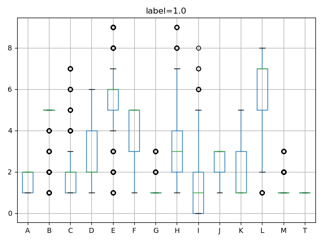
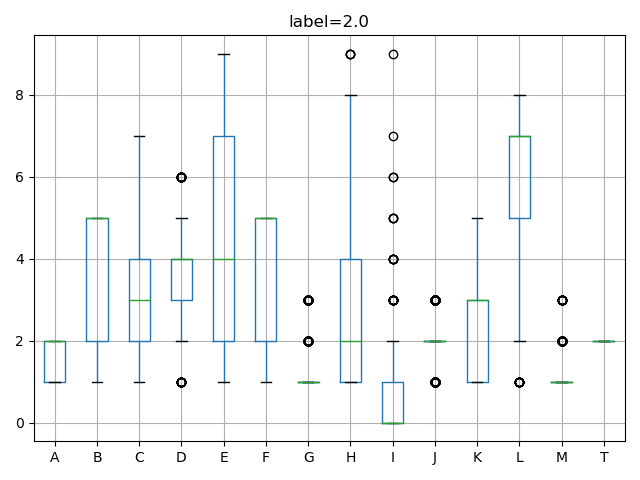
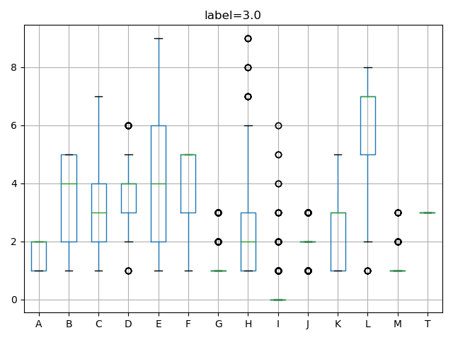
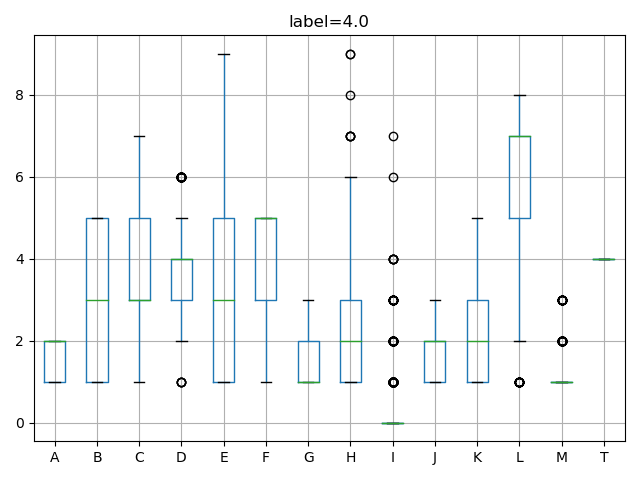
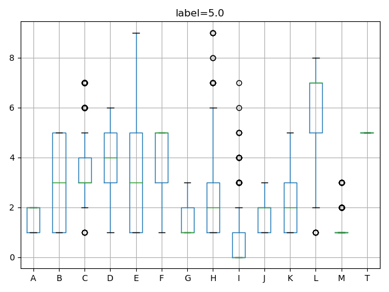
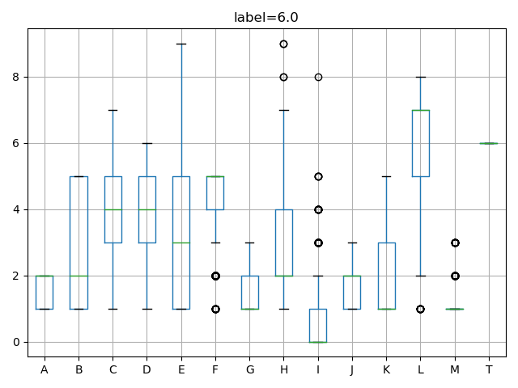
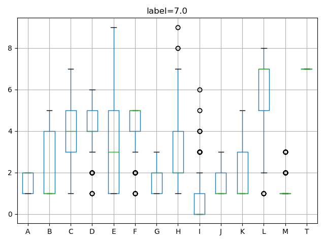
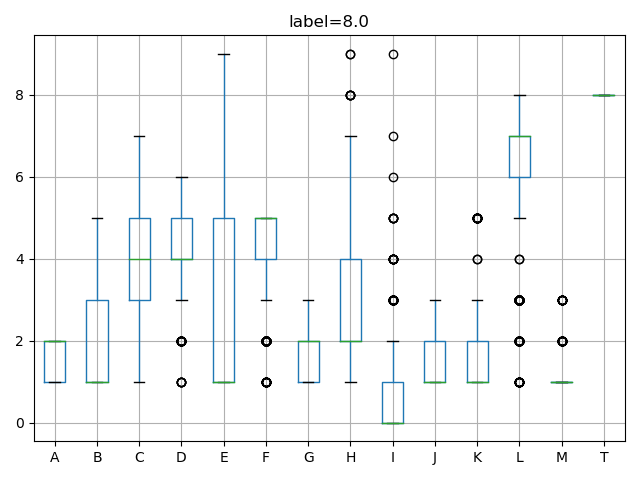
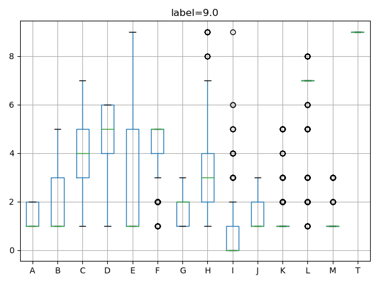

# 2017_Competition_2
河北师范大学 2017 级软件学院 Kaggle 第 2 次竞赛

## 1）实验步骤

1.  使用 pandas 加载数据
2.  训练集空值使用各类别均值进行填充，测试集不做任何处理
3.   以 0 均值 1 方差的方式处理训练集数据，并得到均值和方差 
4.  构建 cart 决策树

<s>基本思想：当遇到训练集空值时，会搜索该节点下所有的可能值。由此，得到的标签可能不止一个，对这些标签进行最近邻的搜索，得到目标标签。</s>

随机森林，没得办法。。。

## 2）函数

1.  `class rootNode()` 生成非叶子节点
2.  `class leafNode()` 生成叶子结点
3.  `cartTree()` 生成 cart 决策树
    *   <s>`pca(self, dataMat, topNfeat=999999)`</s>
    *   `createTree(self, dataSet, ableLabel:list)`
        *   `dataSet` 数据集，为 `np.ndarray` 类型
        *   `ableLabel` 可使用的标签，本决策树为类别消耗型——当结点使用了标签 A，那么其子结点据无法使用标签 A
    *   `get_shannon_entropy(self, dataSet)` 计算数据集的香农熵
    *   `split_dataSet(self, dataSet, axis, value)` 简单的数据切割
    *   `choose_best_feature(self, dataSet, ableLabel)` 选取最佳切割属性
    *   `choose_best_value(self, dataSet, bestAttr)` 选取最佳切割值
    *   <s>`majorityCnt(self, classList)`</s>
    *   `argmaxlabel(self, dataSet)` 计数数据集下每个标签拥有的元素个数
    *   `search(self, elem)` 执行搜索功能
        *   `sampls_search(self, root:rootNode or leafNode, elem)` 决策树搜索功能
        *   `nearset_search(self, elem, labels)` 最近邻搜索
        *   `euclidean_distance(self, var1, var2)` 欧氏距离

## 3）相关内容

## 4）遇到的问题

1.  最小结点的阈值过小会过拟合，过大会欠拟合
2.  数据集可标签分布不均匀，测试集同理